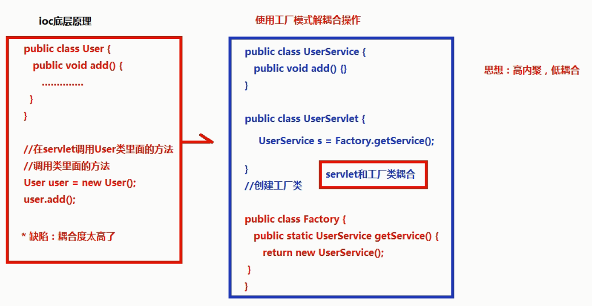
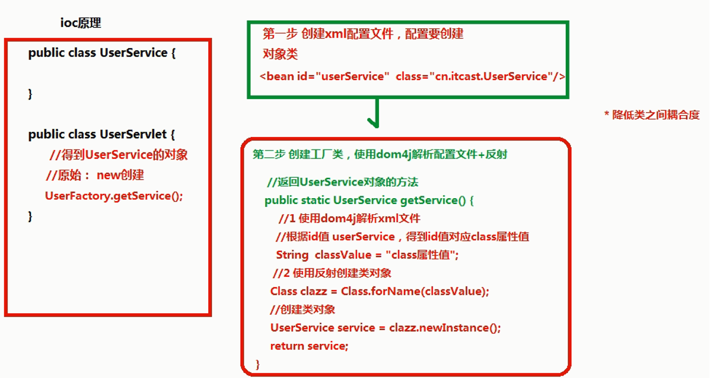
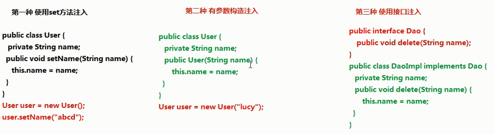

<!-- TOC -->

- [Spring概念](#spring概念)
- [Spring的ioc操作](#spring的ioc操作)
- [IOC底层原理](#ioc底层原理)
- [IOC入门案例](#ioc入门案例)
- [Spring的bean管理（xml方式）](#spring的bean管理xml方式)
    - [Bean实例化的方式](#bean实例化的方式)
    - [Bean标签常用属性](#bean标签常用属性)
    - [属性注入介绍](#属性注入介绍)
- [注入对象类型属性（重点）](#注入对象类型属性重点)
- [P名称空间注入（了解）](#p名称空间注入了解)
- [注入复杂类型属性](#注入复杂类型属性)
- [IOC和DI区别](#ioc和di区别)
- [Spring整合web项目原理](#spring整合web项目原理)

<!-- /TOC -->
## Spring概念
1. spring是开源的轻量级框架  

2. spring核心主要两部分： 

    （1）aop：面向切面编程，扩展功能不是修改源代码实现 

    （2）ioc：控制反转  

    - 比如有一个类，在类里面有方法（不是静态的方法），调用类里面的方法，创建类的对象，使用对象调用方法，创建类对象的过程，需要new出来对象  
    - 把对象的创建不是通过new方式实现，而是交给spring配置创建类对象  

3. spring是一站式框架 

    （1）spring在javaee三层结构中，每一层都提供不同的解决技术  

    - web层：springMVC  
    - service层：spring的ioc  
    - dao层：spring的jdbcTemplate  

4. spring版本 
    spring4.x  

## Spring的ioc操作
1. 把对象的创建交给spring进行管理  

2. ioc操作两部分： 

    （1）ioc的配置文件方式 

    （2）ioc的注解方式 
## IOC底层原理
* ioc底层原理使用技术 

    （1）xml配置文件 

    （2）dom4j解析xml 

    （3）工厂设计模式 

    （4）反射 
     


    
## IOC入门案例  
1. 导入jar包 
    做基础功能时core Container只需要Beans、Core、Context、SpEL四个jar包  
    同时导入支持日志输出的jar包：log4j-1.2.jar和commons-logging-1.2.jar  

2. 创建类，在类里面创建方法  
    ```java
    package me.test.ioc;
    
    public class User {
    
        public void add() {
            System.out.println("add........");
        }
    }
    ```
    （1）spring核心配置文件名称和位置不是固定的  
    - 建议放到src下面，官方建议applicationContext.xml  

    （2）引入schema约束  

    - spring-framework-4.3.9.RELEASE\docs\spring-framework-reference\html\xsd-configuration.html文件中去找（从后往前找）

    ```xml
    <beans xmlns="http://www.springframework.org/schema/beans"
    xmlns:xsi="http://www.w3.org/2001/XMLSchema-instance"
    xsi:schemaLocation="
        http://www.springframework.org/schema/beans http://www.springframework.org/schema/beans/spring-beans.xsd">
    ```

3. 创建spring配置文件，配置创建类  
    ```xml
    <!-- ioc入门 -->
    <bean id="user" class="me.test.ioc.User"></bean>
    ```

4. 写代码测试对象创建  
    这段代码在测试中使用，实际开发不会这样使用  
    ```java
    package me.test.ioc;
    
    import org.junit.Test;
    import org.springframework.context.ApplicationContext;
    import org.springframework.context.support.ClassPathXmlApplicationContext;
    
    public class IOCTest {
    
        @Test
        public void userTest() {
            //1加载spring配置文件，根据配置文件创建对象
            ApplicationContext context = new ClassPathXmlApplicationContext("bean1.xml");
            //2得到配置创建的对象
            User user = (User) context.getBean("user");
            System.out.println(user);
            user.add();
        }
    }
    
    /*结果：
    me.test.ioc.User@35d176f7
    add........ */
    ```
## Spring的bean管理（xml方式）
### Bean实例化的方式  

1. 在spring里面通过配置文件 创建对象
2. bean实例化（创建对象）三种方式实现 

**（1）使用类的无参数构造创建（重点，最常用）** 

通过配置文件Spring会去找类中的无参构造函数创建对象 

类中如果没有无参构造函数，会出现异常：No default  constructor found  

**（2）使用静态工厂创建** 
创建静态的方法，返回类对象 

bean实体

```java
public class bean2 {
    public void add(){
        System.out.println("bean2........");
    }
}
```

工厂类
```java
public class Bean2Factory {
	//静态的方法，返回Bean2对象
	public static bean2 getBean2(){
		return new bean2();
	}
}
```

spring配置
```xml
<!-- 使用静态工厂创建对象 -->
<bean id="bean2" class="bean.Bean2Factory" factory-method="getBean2"></bean>
```

**（3）使用实例工厂创建** 

```java
public class Bean3 {
	public void add(){
		System.out.println("bean3........");
	}
}
```

创建不是静态的方法，返回类对象

```java
public class Bean3Factory {
	//普通的方法，返回Bean3对象
	public Bean3 getBean3() {
		return new Bean3();
	}
}
```

spring配置
```java
<!-- 使用实例工厂创建对象 -->
<!-- 创建工厂对象 -->
<bean id="bean3Factory" class="bean.Bean3Factory"></bean>
<bean id="bean3" factory-bean="bean3Factory" factory-method="getBean3"></bean> 
```
### Bean标签常用属性  
1. id属性：定义的名称，id属性值名称任意命名   

   - id属性值，不能包含特殊符号  
   - 根据id值得到配置对象  

2. class属性：创建对象所在类的全路径  

3. name属性： 
   功能和id属性一样的，id属性值不能包含特殊符号，但是在name属性值里面可以包含特殊符号  
   老版本为兼容struts1的name属性，现在基本只是用id属性  

4. scope属性  

   - singleton：默认值，单例（重点）  

   ```xml
   <bean id="user" class="me.test.ioc.User" scope="singleton"></bean>
   ```

   ```java
   User user = (User) context.getBean("user");
   System.out.println(user);
   
   User user2 = (User) context.getBean("user");
   System.out.println(user2);
   
   //结果是一个对象
   me.test.ioc.User@35d176f7
   me.test.ioc.User@35d176f7
   ```

   - prototype：多例（用在配置action）（重点）  

   ```xml
   <bean id="user" class="me.test.ioc.User" scope="prototype"></bean>
   ```

   ```java
   User user = (User) context.getBean("user");
   System.out.println(user);
   
   User user2 = (User) context.getBean("user");
   System.out.println(user2);
   
   //结果是两个不同的对象
   me.test.ioc.User@5c5a1b69
   me.test.ioc.User@3701eaf6
   ```

   - request：创建对象把对象放到request域里面（了解）  
   - session：创建对象把对象放到session域里面（了解）  
   - globalSession：创建对象把对象放到globalSession里面（全局session）（了解）


### 属性注入介绍
创建对象时候，向类里面属性里面设置值  

* 属性注入的方式介绍（三种方式）
    1. 使用 set() 方法注入
    2. 使用有参数构造注入
    3. 使用接口注入

    Java代码可以实现示例
    
* 在spring框架里面，支持前两种方式  
    1. set方法注入（重点，主要都是通过这种方式）  
    ```java
    package me.test.property;
    public class Book {
        private String bookname;
    
        public void setBookname(String bookname) {
            this.bookname = bookname;
        }
        
        public void bookTest() {
            System.out.println("book...." + bookname);
        }
    }
    ```
    配置文件配置注入的属性和值  
    ```xml
    <!-- 使用set方法注入属性 -->
    <bean id="book" class="me.test.property.Book">
        <!-- 注入属性值
        name属性值：类里面定义的属性名称  
        value属性：设置具体的值	
        -->
        <property name="bookname" value="西游记"></property>
    </bean>
    ```
    测试  
    ```java
    public void bookTest() {
        // 1. 加载Spring配置文件，根据创建对象
        ApplicationContext context = new ClassPathXmlApplicationContext("bean1.xml");
        // 2. 得到配置创建的对象
        Book book = (Book) context.getBean("book");
        book.bookTest();
    }
    
    //结果：book....西游记
    ```
    2. 有参数构造注入（用的不是很多）
    ```java
    package me.test.property;
    
    public class PropertyTestDemo {
    
        private String username;
    
        public PropertyTestDemo(String username) {
            super();
            this.username = username;
        }
        
        public void propertyTest() {
            System.out.println("PropertyTest......" + username);
        }
    }
    ```
    配置文件配置注入的属性和值  
    ```xml
    <!-- 使用有参构造注入属性 -->
    <bean id="property" class="me.test.property.PropertyTestDemo">
        <!-- 使用有参构造 -->
        <constructor-arg name="username" value="张三"></constructor-arg>
    </bean>
    ```
    测试  
    ```java
    public void propertyTest() {
    	ApplicationContext context = new ClassPathXmlApplicationContext("bean1.xml");
    	PropertyTestDemo property = (PropertyTestDemo) context.getBean("property");
    	property.propertyTest();
    }
    
    //结果：PropertyTest......张三
    ```
## 注入对象类型属性（重点）
之前要获取dao对象，action要new一个service对象，service中又要new一个dao对象，现在把new的过程交给spring来操作  
* 具体实现过程（不通过new） 
    dao层

    ```java
    package me.test.ioc;
    public class UserDao {
        public void add() {
            System.out.println("userDao.....");
        }
    }
    ```
    1. 在service里面把dao作为类型属性
    2. 生成dao类型属性的set方法
    ```java
    package me.test.ioc;
    
    public class UserService {
    
        //1 定义dao类型属性
        private UserDao userDao;
        
        //2 生成set方法
        public void setUserDao(UserDao userDao) {
            this.userDao = userDao;
        }
    
        public void add() {
            System.out.println("userService.....");
            // 得到UserDao对象，调用其方法
            userDao.add();
        }
    }
    ```
    3. 配置文件中注入关系
    ```xml
    <!-- 注入对象类型属性 -->
    <!-- 1配置service和dao对象 -->
    <bean id="userDao" class="me.test.ioc.UserDao"></bean>
    
    <bean id="userService" class="me.test.ioc.UserService">
        <!-- 注入dao对象
             name属性值：service里面类属性名称
             现在不要写value属性，因为之前注入是字符串，现在是对象
             写ref属性：dao配置bean标签中id值
        -->
        <property name="userDao" ref="userDao"></property>
    </bean>
    ```
    测试
    ```java
    public void userDaoTest() {
    	ApplicationContext context = new ClassPathXmlApplicationContext("bean1.xml");
    	UserService userService = (UserService) context.getBean("userService");
    	userService.add();
    }
    
    //结果：均得到相应对象，执行其方法
    userService.....
    userDao.....
    ```
## P名称空间注入（了解）
在一个标签中不能写多个相同的属性，用名称空间可以区分不同的属性  
```java
package me.test.ioc;

public class Person {

	private String pname;

	public void setPname(String pname) {
		this.pname = pname;
	}
	public void add() {
		System.out.println("person..." + pname);
	}
}
```
```xml
<?xml version="1.0" encoding="UTF-8"?>
<beans xmlns="http://www.springframework.org/schema/beans"
    xmlns:xsi="http://www.w3.org/2001/XMLSchema-instance"
    //p空间声明
    xmlns:p="http://www.springframework.org/schema/p"
    xsi:schemaLocation="
        http://www.springframework.org/schema/beans http://www.springframework.org/schema/beans/spring-beans.xsd">
    
    <!-- p名称空间注入 
    相对于set方法，不用写<property>  
    -->
    <bean id="person" class="me.test.ioc.Person" p:pname="张三"></bean>
</beans>
```
## 注入复杂类型属性
1. 数组
2. list集合
3. map集合
4. properties类型  
* 实现过程  
    ```java
    package me.test.ioc;

    import java.util.List;
    import java.util.Map;
    import java.util.Properties;

    public class Person {

        private String[] arrs;
        private List<String> list;
        private Map<String, String> map;
        private Properties properties;
            
        public void setArrs(String[] arrs) {
            this.arrs = arrs;
        }
        public void setList(List<String> list) {
            this.list = list;
        }
        public void setMap(Map<String, String> map) {
            this.map = map;
        }
        public void setProperties(Properties properties) {
            this.properties = properties;
        }

        public void add() {
            System.out.println("person..." + arrs);
            System.out.println("person..." + list);
            System.out.println("person..." + map);
            System.out.println("person..." + properties);
        }
    }
    ```
    ```xml
    <!-- 注入复杂类型属性值 -->
    <bean id="person" class="me.test.ioc.Person">
        <!-- 数组 -->
        <property name="arrs">
            <list>
                <value>张三</value>
                <value>李四</value>
                <value>王五</value>
            </list>
        </property>
        
        <!-- list -->
        <property name="list">
            <list>
                <value>昨天</value>
                <value>今天</value>
                <value>明天</value>
            </list>
        </property>
        
        <!-- map -->
        <property name="map">
            <map>
                <entry key="aa" value="一号"></entry>
                <entry key="bb" value="二号"></entry>
                <entry key="cc" value="三号"></entry>
            </map>
        </property>
        
        <!-- properties -->
        <property name="properties">
            <props>
                <prop key="driverclass">com.mysql.jdbc.Driver</prop>
                <prop key="username">root</prop>
                <prop key="password">root</prop>
            </props>
        </property>
    </bean>
    ```
## IOC和DI区别
* IOC：控制反转，把对象创建交给spring进行配置
* DI：依赖注入，向类里面的属性中设置值
* 关系：依赖注入不能单独存在，需要在IOC基础之上完成操作
## Spring整合web项目原理
1. 加载spring核心配置文件  
    ```java
    //1加载spring配置文件，根据配置文件创建对象
    ApplicationContext context = new ClassPathXmlApplicationContext("bean1.xml");
    ```
    每次调用都需要new对象，功能可以实现，效率很低

2. 优化实现思想：把加载配置文件和创建对象过程，在服务器启动时候完成  
3. 实现原理 
    （1）ServletContext对象 
    （2）监听器  

    具体使用：  
    - 在服务器启动时候，为每个项目创建一个ServletContext对象  
    - 在ServletContext对象创建时候，使用监听器可以监听到ServletContext对象在什么时候创建  
    - 使用监听器监听到ServletContext对象创建时候 
      - 加载spring配置文件，把配置文件配置对象创建
      - 把创建出来的对象放到ServletContext域对象里面（setAttribute方法） 
    - 获取对象时候，到ServletContext域得到 （getAttribute方法）  