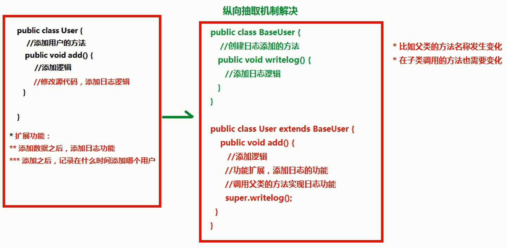
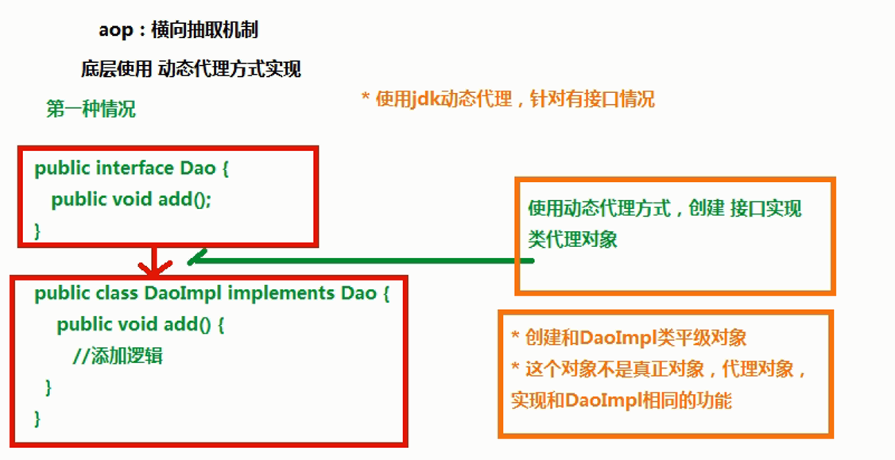
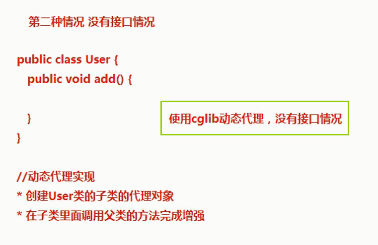
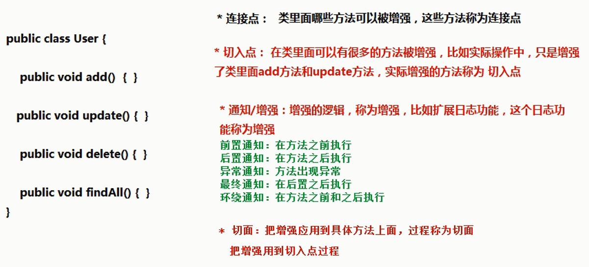

<!-- TOC -->

- [AOP概念](#aop概念)
- [AOP原理](#aop原理)
- [AOP操作术语](#aop操作术语)
- [Spring的aop操作](#spring的aop操作)
    - [AOP操作准备](#aop操作准备)
- [log4j介绍](#log4j介绍)
- [Spring整合web项目演示](#spring整合web项目演示)
- [基于aspectj的注解aop](#基于aspectj的注解aop)

<!-- /TOC -->

## AOP概念

hibernate 要手动进行事务操作，在spring中通过配置文件来配置事务  
1. aop：面向切面编程，扩展功能不修改源代码实现  
2. AOP 采取横向抽取机制，取代了传统纵向继承体系重复性代码
3. aop 底层使用动态代理实现 
    1. 第一种情况，有接口情况，使用动态代理创建接口实现类代理对象 
    2. 第二种情况，没有接口情况，使用动态代理创建类的子类代理对象  
## AOP原理



   


  

## AOP操作术语
1. Joinpoint(连接点): 类里面可以被增强的方法，这些方法称为连接点  
2. **Pointcut(切入点)**:所谓切入点是指我们要对哪些Joinpoint进行拦截的定义  
3. **Advice(通知/增强)**:所谓通知是指拦截到Joinpoint之后所要做的事情就是通知.通知分为前置通知,后置通知,异常通知,最终通知,环绕通知(切面要完成的功能)  
4. **Aspect(切面)**: 是切入点和通知（引介）的结合  
5. Introduction(引介):引介是一种特殊的通知在不修改类代码的前提下, Introduction可以在运行期为类动态地添加一些方法或Field  
6. Target(目标对象):代理的目标对象(要增强的类)  
7. Weaving(织入):是把增强应用到目标的过程 
    把advice 应用到 target的过程
8. Proxy（代理）:一个类被AOP织入增强后，就产生一个结果代理类 
  
## Spring的aop操作
1. 在spring里面进行aop操作，使用aspectj实现 
    （1）aspectj不是spring一部分，和spring一起使用进行aop操作 
    （2）Spring2.0以后新增了对AspectJ支持  
2. 使用aspectj实现aop有两种方式 
    （1）基于aspectj的xml配置 
    （2）基于aspectj的注解方式  
### AOP操作准备
1. 除了导入基本的jar包之外，还需要导入aop相关的jar包 
    aopalliance-1.0.jar 
    aspectjweaver-1.8.7.jar 
    spring-aop-4.3.9.RELEASE.jar 
    spring-aspects-4.3.9.RELEASE.jar
2. 创建spring核心配置文件，导入aop的约束  
    ```xml
    <beans xmlns="http://www.springframework.org/schema/beans"
        xmlns:xsi="http://www.w3.org/2001/XMLSchema-instance"
        xmlns:aop="http://www.springframework.org/schema/aop" xsi:schemaLocation="
            http://www.springframework.org/schema/beans http://www.springframework.org/schema/beans/spring-beans.xsd
            http://www.springframework.org/schema/aop http://www.springframework.org/schema/aop/spring-aop.xsd">  
    </beans>
    ```
* 使用表达式配置切入点
    1. 切入点：实际增强的方法  
    2. 常用的表达式  
    execution(<访问修饰符>?<返回类型><方法名>(<参数>)<异常>)  
    ```
    （1）execution(* cn.itcast.aop.Book.add(..))  
        *是访问修饰符  表示对类里面的某一个方法增强  ..表示如果有参数也包含 

    （2）execution(* cn.itcast.aop.Book.*(..))      表示某个包里面类所有方法  
    （3）execution(* *.*(..))                       表示所有类所有方法  
    （4）execution(* save*(..))                     匹配所有save开头的方法 
    ```
* 基于Aspectj的aop操作实现  
    ```java
    package me.test.aop;

    public class Book {
        public void add() {
            System.out.println("add...");
        }
    }

    package me.test.aop;

    public class MyBook {
        public void before1() {
            System.out.println("前置增强...");
        }

        public void after1() {
		    System.out.println("后置增强...");
	    }
	
        //环绕通知
        public void around1(ProceedingJoinPoint proceedingJoinPoint) throws Throwable {
            //方法之前执行
            System.out.println("方法之前。。。");
            //执行被增强方法
            proceedingJoinPoint.proceed();
            //方法之后执行
            System.out.println("方法之后。。。");
        }
    }
    ```
    使用mybook类before1方法增强book类的add方法  
    ```xml
    <?xml version="1.0" encoding="UTF-8"?>
    <beans xmlns="http://www.springframework.org/schema/beans"
        xmlns:xsi="http://www.w3.org/2001/XMLSchema-instance"
        xmlns:aop="http://www.springframework.org/schema/aop" xsi:schemaLocation="
            http://www.springframework.org/schema/beans http://www.springframework.org/schema/beans/spring-beans.xsd
            http://www.springframework.org/schema/aop http://www.springframework.org/schema/aop/spring-aop.xsd">
        <!-- 1.配置对象 -->
        <bean id="book" class="me.test.aop.Book"></bean>
        <bean id="mybook" class="me.test.aop.MyBook"></bean>
        <!-- 2.配置aop操作 -->
        <aop:config>
            <!-- 2.1配置切入点 -->
            <aop:pointcut expression="execution(* me.test.aop.Book.add(..))" id="pointcut1"/>
            
            <!-- 2.2配置切面 -->
            <aop:aspect ref="mybook">
                <!-- 2.2.1配置增强类型 
                    method:增强类里哪个方法作为前置增强
                    pointcut-ref:增强方法应用在哪个切入点上
                -->
                <aop:before method="before1" pointcut-ref="pointcut1"/>

                <aop:after-returning method="after1" pointcut-ref="pointcut1"/>
            
                <aop:around method="around1" pointcut-ref="pointcut1"/>
            </aop:aspect>
        </aop:config>
    </beans>
    ```
    测试
    ```java
    public void bookTest() {
		ApplicationContext context = new ClassPathXmlApplicationContext("bean3.xml");
		Book book = (Book) context.getBean("book");
		System.out.println(book);
		book.add();
	}
    /*结果
    前置增强...
    方法之前。。。
    add...
    方法之后。。。
    后置增强...
    */
    ```
## log4j介绍
1. 通过log4j可以看到程序运行过程中更详细的信息  
    （1）经常使用log4j查看日志
2. 使用  
    （1）导入log4j的jar包  
    （2）复制log4j的配置文件，复制到src下面  
3. 设置日志级别  
    log4j.rootLogger=info, stdout  
    （1）info：看到基本信息  
    （2）debug：看到更详细信息  
## Spring整合web项目演示
1. 演示问题  
    （1）action调用service，service调用dao（注入）  
    UserAction  
    ```java
    package me.test.action;

    import org.springframework.context.ApplicationContext;
    import org.springframework.context.support.ClassPathXmlApplicationContext;

    import com.opensymphony.xwork2.ActionSupport;

    import me.test.service.UserService;

    public class UserAction extends ActionSupport {

        @Override
        public String execute() throws Exception {
            System.out.println("action...");
            ApplicationContext context = new ClassPathXmlApplicationContext("bean.xml");
            UserService userService = (UserService) context.getBean("userService");
            userService.add();
            return NONE;
        }
    }
    ```
    UserDao
    ```java
    package me.test.dao;

    public class UserDao {

        public void add() {
            System.out.println("dao...");
        }
    }
    ```
    UserService
    ```java
    package me.test.service;

    import me.test.dao.UserDao;

    public class UserService {

        private UserDao userDao;
        
        public void setUserDao(UserDao userDao) {
            this.userDao = userDao;
        }

        public void add() {
            System.out.println("service...");
            userDao.add();
        }
    }
    ```
    Spring配置文件bean.xml 
    ```xml
    <?xml version="1.0" encoding="UTF-8"?>
    <beans xmlns="http://www.springframework.org/schema/beans"
        xmlns:xsi="http://www.w3.org/2001/XMLSchema-instance"
        xmlns:aop="http://www.springframework.org/schema/aop" xsi:schemaLocation="
            http://www.springframework.org/schema/beans http://www.springframework.org/schema/beans/spring-beans.xsd
            http://www.springframework.org/schema/aop http://www.springframework.org/schema/aop/spring-aop.xsd">
        <!--参数配置-->
        <bean id="userDao" class="me.test.dao.UserDao"></bean>
        <bean id="userService" class="me.test.service.UserService">
            <property name="userDao" ref="userDao" ></property>
        </bean>
    </beans>
    ```
    （2）struts.xml中配置action  
    ```xml
    <?xml version="1.0" encoding="UTF-8"?>
    <!DOCTYPE struts PUBLIC
                "-//Apache Software Foundation//DTD Struts Configuration 2.5//EN"
                "http://struts.apache.org/dtds/struts-2.5.dtd">
    <struts>
        <package name="demo" extends="struts-default" namespace="/">
        <action name="user" class="me.test.action.UserAction"></action>
        </package>	
    </struts>
    ```
    （3）web.xml中配置struts2过滤器  
    ```xml
    <filter>
        <filter-name>struts2</filter-name>
        <filter-class>org.apache.struts2.dispatcher.ng.filter.StrutsPrepareAndExecuteFilter</filter-class>
    </filter>
    <filter-mapping>
        <filter-name>struts2</filter-name>
        <url-pattern>/*</url-pattern>
    </filter-mapping>
    ```
    ```
    访问：http://localhost:8080/spring3/user.action  
    结果：
    action...
    service...
    dao...
    ```
    每次访问或刷新action时候，都会加载spring配置文件，性能低  
2. 解决方案：  
    （1）在服务器启动时候，创建对象加载配置文件  
    （2）底层使用监听器、ServletContext对象
3. 在spring里面不需要我们自己写代码实现，帮我们封装好了  
    （1）封装了一个监听器，只需要 配置监听器 就可以了  
    （2）配置监听器之前做事情：导入spring整合web项目jar包  
    spring-web-4.3.9.RELEASE.jar  
    - ContextLoaderListener监听器中已经实现了ServletContextListener 
    ```xml
    <!-- spring配置监听器 -->
    <listener>
        <listener-class>org.springframework.web.context.ContextLoaderListener</listener-class>
    </listener>
    ```
    （3）指定加载spring配置文件位置  
    单独配置监听器后如果不指定spring的加载文件，是找不到监听器的，默认到下面路径中找指定的文件并抛出异常  
    ```
    java.io.FileNotFoundException: Could not open ServletContext resource [/WEB-INF/applicationContext.xml]
    ```
    指定自定义名称及位置  
    在web.xml中设置
    ```xml
    <!-- 指定spring配置文件位置 -->
    <context-param>
        <param-name>contextConfigLocation</param-name>
        <param-value>classpath:bean.xml</param-value>
    </context-param>

    <!-- param-name:contextConfigLocation
    是配置的监听器ContextLoaderListener的父类ContextLoader中的一个常量的值
    public static final String CONFIG_LOCATION_PARAM = "contextConfigLocation";

    param-value是配置文件名称，写法固定 classpath：配置文件名.xml
    -->
    ```
## 基于aspectj的注解aop
1. 使用注解方式实现aop操作 
    导包，引入约束 
    两个类Book和MyBook，增强Book类中的add()方法 
    （1） 创建对象 
    （2） 在spring核心配置文件中，开启aop操作 

    ```xml
    <!-- 1.配置对象 -->
    <bean id="book" class="me.test.aop.Book"></bean>
    <bean id="mybook" class="me.test.aop.MyBook"></bean>
    
    <!-- 开启aop操作 -->
    <aop:aspectj-autoproxy></aop:aspectj-autoproxy>
    ```
    （3） 在增强类上面使用注解完成aop操作  
    ```java
    package me.test.aop;
    
    import org.aspectj.lang.ProceedingJoinPoint;
    import org.aspectj.lang.annotation.AfterReturning;
    import org.aspectj.lang.annotation.Around;
    import org.aspectj.lang.annotation.Aspect;
    import org.aspectj.lang.annotation.Before;
    
    @Aspect
    public class MyBook {
        
        //在方法上面使用注解完成增强配置
        @Before(value="execution(* me.test.aop.Book.*(..))")
        public void before1() {
            System.out.println("前置增强...");
        }
        
        @AfterReturning(value="execution(* me.test.aop.Book.*(..))")
        public void after1() {
            System.out.println("后置增强...");
        }
        
        //环绕通知
        @Around(value="execution(* me.test.aop.Book.*(..))")
        public void around1(ProceedingJoinPoint proceedingJoinPoint) throws Throwable {
            //方法之前执行
            System.out.println("方法之前。。。");
            //执行被增强方法
            proceedingJoinPoint.proceed();
            //方法之后执行
            System.out.println("方法之后。。。");
        }
    }
    ```
    |AspectJ提供不同的通知类型||
    |:-:|:-|
    |@Before|前置通知，相当于BeforeAdvice|
    |@AfterReturning|后置通知，相当于AfterReturningAdvice|
    |@Around|环绕通知，相当于MethodInterceptor|
    |@AfterThrowing|抛出通知，相当于ThrowAdvice|
    |@After|最终final通知，不管是否异常，该通知都会执行|

