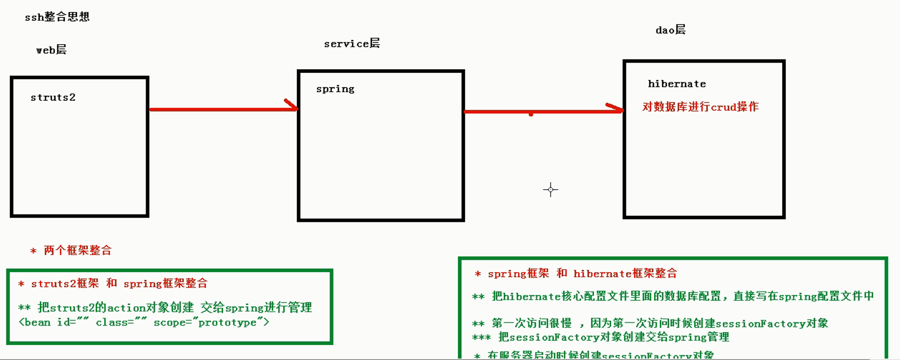

## 回顾SSH框架知识点  
### Hibernate框架  
1.  hibernate核心配置文件  
    （0）orm思想  
    - 对象关系映射，让实体类跟数据库表字段进行对应关系  

    （1）数据库信息  
    （2）hibernate信息  
    （3）映射配置  
    （4）hibernate核心配置文件  
    - 如果单纯使用hibernate框架，核心配置文件名称 hibernate.cfg.xml和位置 src下面 固定的  
    - hibernate和spring **整合**时候，hibernate核心配置文件名称和位置 **没有固定要求的**  
2.  hibernate映射配置文件  
    （1）实体类和数据库表映射关系—使用orm思想  
3.  hibernate操作的步骤  
    在spring框架对hibernate框架进行封装，使用hibernateTemplate  
### Struts2框架
1.  Action操作  
    （1）action创建三种方式  
    - 写个普通类  
    - 写个类实现一个接口  
    - 继承类 ActionSupport  

    （2）配置action访问路径  
    - 创建struts.xml配置文件，这个文件名称和位置固定 src下面的  

    （3）配置访问action的多个方法  
    - 使用通配符方式配置；method属性中直接写方法名字  

    （4）在action获取表单提交数据  
    - 获取request对象  
    ** 使用ServletActionContext类获取
    - 属性封装  
    - 模型驱动（重点）  
    - 表达式封装  

    （5）在action操作域对象  
    - 使用ServletActionContext获取域对象  

    （6）配置struts2的过滤器StrutsPrepareAndExcuteFilter  

2.  值栈  
    （1）向值栈放数据  
    - set方法  
    - push方法  
    - 定义变量，生成get方法  

    （2）从值栈获取数据  
    - 在jsp中使用struts2标签+ognl获取  
    - <s:property>  
    - <s:iterator>  
3.  拦截器  
    （1）aop和责任链模式  
    （2）自定义拦截器  
    - 继承MethodFilterInterceptor  
    - 重写类里面的方法  
    - 配置拦截器和action关联  
### Spring框架
1.  spring核心配置文件  
    （1）名称和位置没有固定要求  
    （2）在spring核心配置文件中引入schema约束  
2.  创建对象  
    （1）xml配置方式：<bean  id=””  class=””  scope=””/>  
    （2）注解方式：四个注解  
    - @Component  
    - @Controller  
    - @Service  
    - @Repository  
3.  注入属性(对象类型属性)  
    （1）xml配置方式  
    （2）注解方式：两个注解  
    - @Autowired  
    - @Resource  
4.  使用ServletContext对象和监听器实现  
    （1）在服务器启动时候，加载spring配置文件，创建对象  
    （2）配置spring的监听器  
    （3）指定spring配置文件位置  
5.  jdbcTemplate  
6.  spring事务配置  
    （1）xml方式  
    （2）注解方式  
## SSH框架整合思想
1.  三大框架应用在javaee三层结构  
2.  struts2框架和spring整合  
    （1）struts2的action在spring配置  
3.  spring框架和hibernate框架整合  
    （1）hibernate的sessionFactory交给spring配置  
    （2）把hibernate数据库配置交给spring配置  
  
## 整合struts2和spring框架
1.  把struts2的action交给spring管理  

2.  实现过程  
    （1）导入struts2和spring的jar包  
    用于整合jar包：struts2-spring-plugin-2.3.34.jar；spring-web-4.3.9.RELEASE.jar  
    （2）创建action  
    （3）创建struts2核心配置文件，配置action  
    - 位置在src下面，名称是struts.xml  
    ```xml
    <?xml version="1.0" encoding="UTF-8"?>
    <!DOCTYPE struts PUBLIC
                "-//Apache Software Foundation//DTD Struts Configuration 2.5//EN"
                "http://struts.apache.org/dtds/struts-2.5.dtd">
    <struts>
        <package name="demo" extends="struts-default" namespace="/">
        <!-- class属性里就不写action全路径了，因为会分别在struts2和spring中创建两次
            写Spring配置的action的bean的id值
            -->
        <action name="userAction" class="userAction" ></action>
        </package>	
    </struts>
    ```
    （4）在web.xml中配置struts2过滤器  
    ```xml
    <!-- struts2拦截器 -->
    <filter>
        <filter-name>struts2</filter-name>
        <filter-class>org.apache.struts2.dispatcher.ng.filter.StrutsPrepareAndExecuteFilter</filter-class>
    </filter>

    <filter-mapping>
        <filter-name>struts2</filter-name>
        <url-pattern>/*</url-pattern>
    </filter-mapping>
    ```
    （5）导入spring的jar包  
    （6）创建spring配置文件  
    1. 引入约束  
    2. 在web.xml中配置spring监听器（服务器启动时加载spring配置文件）
    3. 指定spring配置文件位置（名字到监听器源代码中找）  
    ```xml
    <!-- web.xml中spring配置监听器 -->
    <listener>
        <listener-class>org.springframework.web.context.ContextLoaderListener</listener-class>
    </listener>
    
	<!-- 指定spring配置文件位置 -->
	<context-param>
	  <param-name>contextConfigLocation</param-name>
	  <param-value>classpath:bean.xml</param-value>
	</context-param>
    ```
    （7）把action交给spring进行配置（重点） 
    ```xml
    <!-- 配置action对象 -->
    <bean id="userAction" class="me.test.action.UserAction" scope="prototype"></bean>
    ``` 
    - 在spring配置action对象，在struts.xml中也配置action对象？  
    解决：只需要在spring里面配置action对象，不要在struts.xml中配置  
    修改struts2配置文件
    ```xml
    <!-- class属性里就不写action全路径了，因为会分别在struts2和spring中创建两次
        写Spring配置的action的bean的id值
    -->
    <action name="userAction" class="userAction" ></action>
    ```
    加入日志文件：log4j.properties
## Spring框架整合hibernate框架
1.  把hibernate核心配置文件中配置数据库信息，把数据库信息在spring进行配置  
2.  把hibernate里面的sessionFactory创建交给spring管理  
### 具体实现
1.  导入hibernate的jar包
    （1）导入struts2和hibernate的jar包时候有jar冲突问题  
    在struts2里面有jar包:javassist-3.11.0.GA.jar  
    在hibernate里面有jar包javassist-3.23.1-GA.jar  
    删除低版本的jar包  
    （2）导入spring整合持久化层框架需要导入jar包  
    spring-orm-4.3.9.RELEASE.jar  
2.  搭建hibernate环境搭建  
    （1）创建实体类  
    ```java
    package me.test.entity;

    public class User {

        private Integer userid;
        private String username;
        private String password;
        
        public Integer getUserid() {
            return userid;
        }
        public void setUserid(Integer userid) {
            this.userid = userid;
        }
        public String getUsername() {
            return username;
        }
        public void setUsername(String username) {
            this.username = username;
        }
        public String getPassword() {
            return password;
        }
        public void setPassword(String password) {
            this.password = password;
        }
    }
    ```
    （2）配置实体类映射关系  
    ```xml
    <?xml version="1.0" encoding="UTF-8"?>
    <!DOCTYPE hibernate-mapping PUBLIC 
        "-//Hibernate/Hibernate Mapping DTD 3.0//EN"
        "http://www.hibernate.org/dtd/hibernate-mapping-3.0.dtd">
    <hibernate-mapping>
        <class name="me.test.entity.User" table="user">
            <id name="userid" column="userid">
                <generator class="native"></generator>
            </id>
            <property name="username" column="username"></property>
            <property name="password" column="password"></property>
        </class>
    </hibernate-mapping>
    ```
    （3）创建核心配置文件  
    - 加入工具类HibernateUtils.java，测试配置是否正确  
    ```xml
    <?xml version="1.0" encoding="UTF-8"?>
    <!DOCTYPE hibernate-configuration PUBLIC
        "-//Hibernate/Hibernate Configuration DTD 3.0//EN"
        "http://www.hibernate.org/dtd/hibernate-configuration-3.0.dtd">
    <hibernate-configuration>
        <session-factory>
        
            <!-- <property name="hibernate.connection.driver_class">org.mariadb.jdbc.Driver</property>
            <property name="hibernate.connection.url">jdbc:mariadb://localhost:3306/test1</property>
            <property name="hibernate.connection.username">root</property>
            <property name="hibernate.connection.password">root</property> -->
            
            <!-- 第二部分：配置 hibernate信息 -->
            <!-- 输出底层sql语句 -->
            <property name="hibernate.show_sql">true</property>
            <!-- 输出底层sql语句格式化 -->
            <property name="hibernate.format_sql">true</property>
            <!-- hibernate创建表，需要配置之后 
                update：如果已经有表，更新表；如果没有，帮助创建
            -->
            <property name="hibernate.hbm2ddl.auto">update</property>
            <!-- 配置数据库方言
                        在mysql里面实现分页 关键字limit，只能使用在mysql中  
                        在oracle数据库,实现分页rownum
                        让hibernate框架识别不同数据库的自己特有的语句
            -->
            <property name="hibernate.dialect">org.hibernate.dialect.MySQL5InnoDBDialect</property>
            <!-- 配置session绑定本地线程 
                thread：Session对象的生命周期与本地线程绑定
                jta：Session对象的生命周期与JTA事务绑定
                managed:hibernate委托程序来管理session对象的生命周期
            -->
            <property name="hibernate。current_session_context_class">thread</property>
            
            <!-- 第三部分：把映射文件放到核心配置文件中 必须的-->
            <mapping resource="me/test/entity/User.hbm.xml" />
        </session-factory>
    </hibernate-configuration>
    ```
    hibernate工具类
    ```java
    package me.test.utils;

    import org.hibernate.Session;
    import org.hibernate.SessionFactory;
    import org.hibernate.cfg.Configuration;

    public class HibernateUtils {
        
        private static Configuration cfg;
        private static SessionFactory sessionFactory;
        //静态代码块实现
        static {
            //加载核心配置文件
            cfg = new Configuration();
            cfg.configure();
            sessionFactory = cfg.buildSessionFactory();
        }
        
        //提供方法返回sessionFactory
        public static SessionFactory getSessionFactory() {
            return sessionFactory;
        }
        
        //提供返回与本地线程绑定的session方法
        public static Session getSessionobject() {
            return sessionFactory.getCurrentSession();
        }
        
        public static void main(String[] args) {

        }
    }
    ```
    测试时先把配置数据库的信息打开，运行该类，数据库中创建了一个表，说明搭建了hibernate环境  
3.  把hibernate核心配置文件数据库配置，在spring进行配置  
    （1）把hibernate核心文件中数据库配置去掉了，在spring配置  
4.  把hibernate的sessionFactory交给spring配置  
    （1）服务器启动时候，加载spring配置文件，把配置文件中对象创建  
    （2）把sessionFactory对象创建在spring配置  
    （3）因为创建sessionFactory代码不是new出来的，而是多行代码实现的  
    ```java
    static {
        //加载核心配置文件
        cfg = new Configuration();
        cfg.configure();
        sessionFactory = cfg.buildSessionFactory();
    }
    ```
    （4）spring里面针对上面情况，封装类，配置类对象可以创建sessionFactory    
    org.springframework.orm.hibernate5.LocalSessionFactoryBean  
    ```xml
    <!-- sessionFactory创建交给spring管理 -->
    <bean id="sessionFactory" class="org.springframework.orm.hibernate5.LocalSessionFactoryBean">
        <!-- 因为在hibernate核心配置文件中，没有数据库配置，数据库配置在spring里面配置，所以需要注入datasource -->
        <property name="dataSource" ref="dataSource"></property>
        
        <!-- 指定使用hibernate核心配置文件 -->
        <property name="configLocations" value="classpath:hibernate.cfg.xml"></property>
    </bean>
    ```
    启动服务器就创建了表验证了sessionFactory交给了spring管理了  
5.  在dao里面使用hibernateTemplate  
    （1）在dao得到hibernateTemplate的对象  
    ```java
    package me.test.dao.impl;

    import org.springframework.orm.hibernate5.HibernateTemplate;

    import me.test.dao.UserDao;
    import me.test.entity.User;

    public class UserDaoImpl implements UserDao {

        //得到hibernateTemplate对象
        private HibernateTemplate hibernateTemplate;
        
        public void setHibernateTemplate(HibernateTemplate hibernateTemplate) {
            this.hibernateTemplate = hibernateTemplate;
        }

        //添加操作
        public void add() {
            //hibernateTemplate就是对hibernate的封装
            //HibernateTemplate hibernateTemplate = new HibernateTemplate();
            //hibernateTemplate.saveOrUpdate(entity);
            User user = new User();
            user.setUsername("张三");
            user.setPassword("123");
            
            hibernateTemplate.save(user);
        }
    }
    ```
    （2）调用hibernate模板里面save方法添加  
    没有配置事务，做操作时候，出现异常  
    ```
    Write operations are not allowed in read-only mode (FlushMode.MANUAL): Turn your Session into FlushMode.COMMIT/AUTO or remove 'readOnly' marker from transaction definition.
    ```
    事务不会自动提交，只读状态  
6.  配置事务  
    ```xml
    <!-- 配置事务管理器-->
    <bean id="transactionManager" class="org.springframework.orm.hibernate5.HibernateTransactionManager">
        <!-- 注入sessionFactory(sessionFactory也包含dataSource) -->
        <property name="sessionFactory" ref="sessionFactory"></property>
    </bean>
    
    <!-- 开启事务注解 -->
    <tx:annotation-driven transaction-manager="transactionManager"/>
    ```
    在service类上添加注解
    ```java
    @Transactional
    public class UserService {}
    ```
### HibernateTemplate介绍
1.  HibernateTemplate对hibernate框架进行封装  
    直接调用HibernateTemplate里面的方法实现功能  
2.  HibernateTemplate常用的方法  
    - Serializable save(Object entity) ：添加操作  
    - void update(Object entity) ：修改操作  
    - void delete(Object entity) ：删除操作  
    - <T> T get(Class<T> entityClass, Serializable id) ：根据id查询  
    - <T> T load(Class<T> entityClass, Serializable id)： 根据id查询  
    ```java
    //根据id查询
        public User getUser() {
            User user = hibernateTemplate.get(User.class, 1);
            return null;
        }

        //find查询所有记录
        public List find() {
            List<User> list = (List<User>) hibernateTemplate.find("from User");
            return null;
        }
        
        //find条件查询 
        //（1）第一个参数是 hql语句 （2）语句参数值
        public List findFor() {
            List<User> list = (List<User>) hibernateTemplate.find("from User where username=?","张三");
            return null;
        }
    ```
    find方法本身无法实现分页，需要使用下面这个方法    
    ```java
    public List<?> findByCriteria(final DetachedCriteria criteria, final int firstResult, final int maxResults)
    ```
## j整合其他方式
spring整合hibernate时候，可以不写hibernate核心配置文件  
    （1）把hibernate核心配置文件中，基本信息配置和映射引入都放到spring配置  
    配置到sessionFactory下  
```xml
<!-- sessionFactory创建交给spring管理 -->
<bean id="sessionFactory" class="org.springframework.orm.hibernate5.LocalSessionFactoryBean"> 
    <!-- 如果不写hibernate核心配置文件  -->
    <!-- hibernate基本信息配置 -->
    <property name="hibernateproperties">
        <props>
            <!-- 配置数据库方言 -->
            <prop key="hibernate.dialect">org.hibernate.dialect.MySQL5InnoDBDialect</prop>
            <!-- 输出底层sql语句 -->
            <prop key="hibernate.show_sql">true</prop>
            <!-- 输出底层sql语句格式化 -->
            <prop key="hibernate.format_sql">true</prop>
            <!-- hibernate创建表 -->
            <prop key="hibernate.hbm2ddl.auto">update</prop>
        </props>
    </property>   
    <!-- 把映射文件引入配置-->
    <property name="mappingResources">
        <list>
            <value>me/test/entity/User.hbm.xml</value>
        </list>
    </property>
</bean>
```
## Spring分模块开发
1.  在spring里面配置多个内容，造成配置混乱，不利用维护  
2.   把spring核心配置文件中，一部分配置放到单独的配置文件中，在spring核心配置文件中引入单独配置文件  
    ```xml
    <!-- 引入其他spring配置文件 -->
        <import resource="classpath:bean2.xml"/>
    ```
